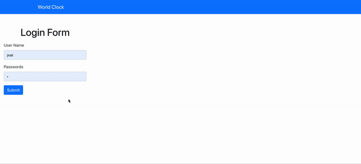
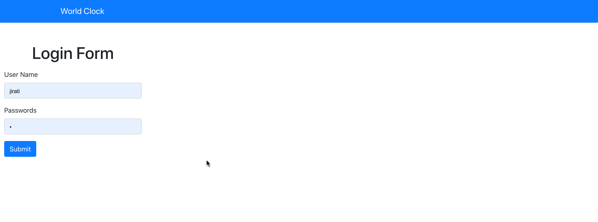
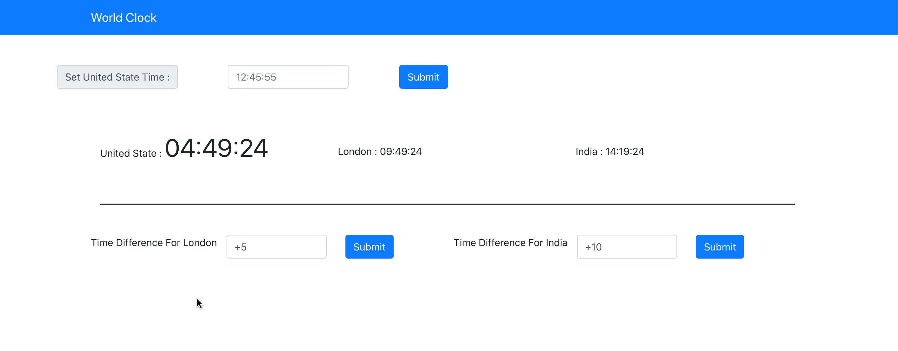

# World Clock

## Preview

## Login Page

## Clock Page

# How to setup the Project on local System?

    1.First you need to download this repo.
    2.Then open in the editor.
    3.Install Node js in your system if not installed.
    4.run the command for installing the modules.
     >>npm install
    5.run the project by commmand.
    >> npm start

# How it Works?

    1. First You need to login into the clock by.
       username = "jirati"
       password = "1"
    2. Then when you login the app then you show the real time of India,London and United State.
    3. The time that you see are the real time.
    4. When you set the time by united state field then click submit then all time will be set accoding to it.
    5. When you give the difference in the difference field then you will show the changes according to it.
    6. If you do nothing then the clock will automatically update after Five second.
